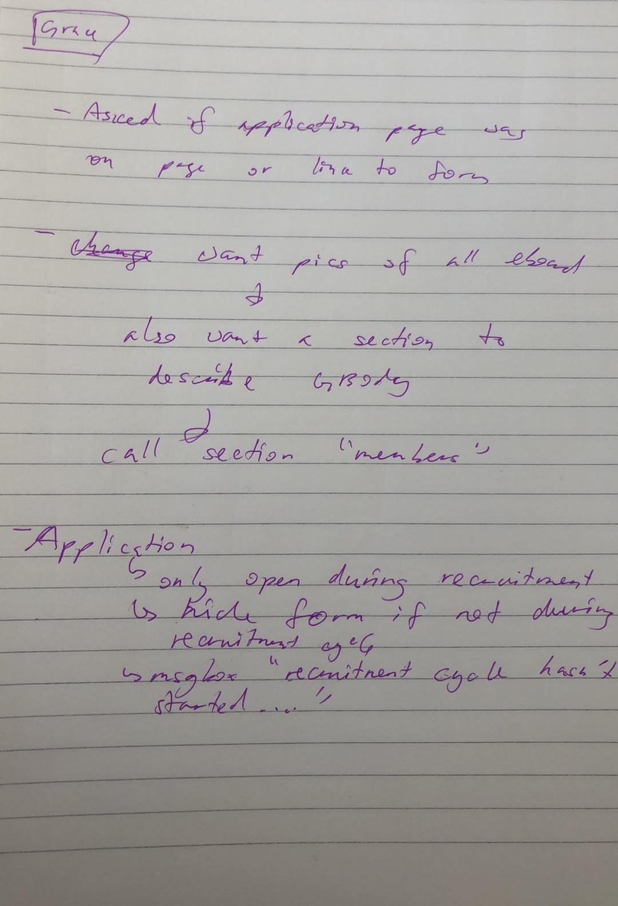

# Project 4 - Design & Plan

Be clear and concise in your writing. Bullets points are acceptable.

# Planning

## Client Description (Milestone 1) <!-- Shichen -->
> Tell us about your client. Who is your client? What kind of website do they want? What are their key goals?

Our client is Cornell's Mainland China Student Association. It is a cultural organization aiming to bridging the Chinese student body and the Cornell community together, and they welcome everyone interested to get on board. During every semester, they organize events that increase understanding of Chinese culture and give students resources and opportunities to be more involved in the Cornell Community. Members have close relationships with each other and grow a lot by organizing events together.

## Site's Purpose (Milestone 1) <!-- Shichen -->
> Tell us the purpose of the website and what it is all about.

The purpose of the website is to provide potential members of MCSA some information about the club and to encourage these members to take action into applying. To promote this purpose, we will provide information about the club's mission, goals, members, events, and contact information. These will all serve to ultimately convince visitors to apply to join the club in the last section of the website.

## Client Meeting Notes (Milestone 1) <!-- Shichen -->
> Include your notes/minutes from the client meeting, an email they sent you, or whatever you used to keep track of what was discussed at the meeting.

1. Overview of MCSA - cultural org targeting mainland Chinese students on campus
2. Pages desired - homepage (group photo and description), about, members (link to email address), alumni highlights (may be combined with members page), events, get involved/apply now page
3. Content acquisition - the client sent us a powerpoint that is used during information session with useful club information and photos; we created a drive folder to store more information shared in the future; team will work on copywriting to be approved by client
4. Branding/visual aesthetic - will send logos; we will mainly use red and white to match their logo and powerpoint
5. Future meetings/touch base - will coordinate future meetings and communicate regularly via email/Messenger, looking to a meeting next weekend

## Client Needs and Wants (Milestone 1) <!--Alston-->
> Collect your client's needs and wants for the website. Come up with several appropriate design ideas on how those needs may be met. In the **Memo** field, justify your ideas and add any additional comments you have. There is no specific number of needs required for this, but you need enough to do the job.

Need/Want: [Events]
- **Needs and Wants** [What do the clients need and want?]
- Client want to highlight the club involvement on campus and allow people to learn about some of the events the members of the organization have participated in
- **Design Ideas and Choices** [How will you meet those needs and wants?]
- We will create a page for Events to highlight the client's involvement on Cornell campus
- **Rationale & Additional Notes** [Justify your decisions; additional notes.]
- We will include photos and descriptions of the events to give users a glimpse.

Need/Want: [Members]
- **Needs and Wants** [What do the client need and want?]
- The client wants to show website visitors the E-Board members.
- **Design Ideas and Choices** [How will you meet those needs and wants?]
- We will include a page to introduce all the active members on E-Board.
- **Rationale & Additional Notes** [Justify your decisions; additional notes.]
- We will include extra information about E-Board members including their role in the club, their major, and the year they are graduating.

Need/Want: [Contact]
- **Needs and Wants** [What do the client need and want?]
 - The client want to make their club social media information accessible to potential members.
- **Design Ideas and Choices** [How will you meet those needs and wants?]
 - We will create a section for contact, where users will be able to find different means of contact information
- **Rationale & Additional Notes** [Justify your decisions; additional notes.]
 - Include email, Instagram, Facebook, etc...

 Need/Want: [Recruitment Information]
- **Needs and Wants** [What do the users need and want?]
 - The clients wants users to be able to provide their information through the website so that recruitment will become easier later on.
- **Design Ideas and Choices** [How will you meet those needs and wants?]
 - On the Application page we will include an application form.
- **Rationale & Additional Notes** [Justify your decisions; additional notes.]
 - We will ask the users to provide basic information like NETID and their school year. With this information, our client will be able to reach out to these students easily.

## User(s) (Milestone 1)
> Tell us about the users (target audience) for this website.

Our target audience are Cornell students who are interested in Chinese culture and want to join MCSA. They will use this website to get the general information of MCSA, including what is it about, its mission statement, the members and structure, the events held by them, recruitment timeline and requirements, and so on. They will be able to submit their applications through this website. We interviewed four freshmen at Cornell. Two of them are American-born-Chinese and the other two come from China. All of them do not know much about the cultural clubs on campus and have not heard of MCSA before.

## Discovering Users' Needs (Milestone 1) <!-- Alston -->
> You'll need to discover your users' needs. Talk to them! Document what you've learned about them. When talking to your users, take notes and include those notes here.

Questions:

What would you like to learn about MCSA?

Potentials stated they would like more information about the club's campus involvement, professional development, as well as some of the events that the club hosts.

Are there any questions or concerns you would like us to address?

1) Is this club exclusive to Chinese students of the Cornell Community?
2) Do you have to be able to speak Chinese to be a part of the organization?
3) Who can I contact for more information?
4) How can I join?
5) Where can I learn more about the club's campus involvement?

## Users' Needs (Milestone 1) <!-- Shichen and Alston -->
> Analyze the users' needs and wants from your notes above. List each need/want below. There is no specific number of needs required for this, but you need enough to do the job.
> **Note:** These are probably *not* the needs of your client.

 Need/Want: [Events]
- **Needs and Wants** [What do the users need and want?]
 - User want to see the club involvement on campus and learn about some of the potential events the members of the organization partake in
- **Design Ideas and Choices** [How will you meet those needs and wants?]
 - We will create a page for Events to give users the opportunity to learn more about their involvement on campus
- **Rationale & Additional Notes** [Justify your decisions; additional notes.]
 - We will include photos and descriptions of the events to give users a glimpse.

Need/Want: [Members]
- **Needs and Wants** [What do the users need and want?]
 - The users want information about the active members of the organization
- **Design Ideas and Choices** [How will you meet those needs and wants?]
 - We will include a page to introduce all the active members as well as the alumnus.
- **Rationale & Additional Notes** [Justify your decisions; additional notes.]
 - We will also introduce the big-little system to give users more information about the relationships of members.

 Need/Want: [Contact]
- **Needs and Wants** [What do the users need and want?]
  - Users want to know who they will be able to contact and how they will be able to contact those people for more information.
- **Design Ideas and Choices** [How will you meet those needs and wants?]
  - We will create a section for contact, where users will be able to find different means of contact information
- **Rationale & Additional Notes** [Justify your decisions; additional notes.]
  - Include email, Instagram, Facebook, etc...

  Need/Want: [Mission Statement]
- **Needs and Wants** [What do the users need and want?]
  - The users want to know what's it for, their reason for existence, and how the members think of it.
- **Design Ideas and Choices** [How will you meet those needs and wants?]
  - We will definitely include their mission statement on the Homepage, and will probably interview some of the members for their comments and thoughts on their experience of the club.
- **Rationale & Additional Notes** [Justify your decisions; additional notes.]
  - Mission statement is very important, so we will put it on the Homepage. Members' thoughts can be on Members page or About page.

  Need/Want: [Recruitment Information]
- **Needs and Wants** [What do the users need and want?]
  - The users ask about recruitment, including what kinds of people they are looking for, when do they usually recruitment, and whether there will be any info session recently.
- **Design Ideas and Choices** [How will you meet those needs and wants?]
  - On the Application page we will include our client's criteria for new members, their recruitment timeline, and upcoming info session time if there is one.
- **Rationale & Additional Notes** [Justify your decisions; additional notes.]
  - Recruitment information is important for the target audience. By having some basic recruitment information, our client will seems more approachable and the audience will Feel more encouraged to apply. They will have access to reach out for the client for further information also.

## User Testing Plan (Milestone 1) <!-- Anyi -->
> Plan out your tasks for evaluating whether your site will meet the needs of the users. These must be actual user testing tasks. Tasks are not questions!

1. Find out who is on the executive board of MCSA.

2. Find the mission statement of MCSA.

3. Find two events hosted by MCSA.

4. Apply to join MCSA.

## Content (Milestone 1) <!-- Emily and Sabrina-->
> Plan out your site's content (text, images, etc.). Make a list of **all** the content you will need. This list should be **exhaustive**.

- Group Photo
- Goals
- Action
- Mission Statement
- Member profiles (Pictures, Bio, Position if applicable)
- Alumni profiles (Pictures, Statement)
- Types of events
- Specific events
- The Big and little system
- Past Event pictures
- Application
- Club email
- Club Instagram
- Club Facebook
- Club WeChat
- Detailed About
- Recruitment Criteria
- Recruiting Timeline
- Info Session Time (if there will be one recently)
- Reason for applying

## Interactivity Ideas (Milestone 1) <!-- Anyi -->
> Come up with some idea for interactive features for your site.

- Application form for a future recruitment cycle
- Toggle button to change the entire webpage to Chinese
- Gallery

# Design & Evaluation

## Design Process (Milestone 1) <!-- Emily and Sabrina -->
> Document your design process. Show us your card sorting. Design your navigation from the card sorting. Outline your navigation. Describe your theme. Show us sketches of your site (mobile and desktop versions). etc.
> You should show us how your came up with your design and how your iterated on that design; show us the evolution of your design.

> **Note:** Card sorting is used to organize your site's content. For each piece of content identified in the previous section, write a summary of that content onto a card. Now sort the cards. The grouping of cards provides you with your pages for your website. **Do not write down the pages you want and then "card sort" those. That is not card sorting.**

### Card Sorting

All of our content into the following five categories:

**Home:**
 - Group photo
 - Mission Statement(brief)
 - Contact Info
   - Club Facebook
   - Club Instagram
   - Club email
   - Club Wechat

**About:**
 - Detailed About(Who We Are)
 - Mission Statement(complete)
 - Action
 - Goals
 - Club Organization (Big Little System)

**Members:**
 - Current Member Profile (Pictures, Bio, Position if applicable)
 - Alumni Profile (Pictures, Statement)

**Events**
- Description and photo
- Specific events
- Type of Events

**Application:**
- Recruitment Criteria
- Recruiting Timeline
- Info Session Time (if there is one upcoming)
- Application Form
  - Name
  - NetID
  - Year of graduation
  - Reason for applying
  - _reach out to client about specific application req_

### Design Goals & Theme

Our client wants their online presence to be professional, but not too serious as they are a cultural organization. The website should also attract the interest of potential club members. Our design goals are built around this idea of balancing professionalism and approachability. The website should have a clean look and information should be easy to find.  

When asked about what colors they would like to be included in the color scheme of the website, the client said that red and white should definitely be included, as those are the colors present in their logo. To keep the website easy to read, we will have the background a shade of white and use the red as an accent color. To keep the website easy and comfortable to view for the audience, we will avoid bright or contrasting colors as we move forward in our design. A Sans Serif font is fitting for the theme of the website because it provides easy to read text without having the formality associated with a serif font.

### Page Draft Sketches

**Desktop Design:**

Home:  <!-- Alston -->

About:  <!-- Shichen -->

Members:  <!-- Anyi -->

Events: <!-- Emily -->

Apply:  <!-- Sabrina -->

**Mobile Design:**

Home:  <!-- Alston -->

About:  <!-- Shichen -->

Members:  <!-- Anyi -->

Events: <!-- Emily -->

Apply:  <!-- Sabrina -->

## Interactivity (Milestone 1) <!-- Anyi -->
> What interactive features will your site have? Describe how the interactivity connects with the needs of the clients/target audience.

Our site will have two interactive features. The first is a gallery feature that allows website visitors to look through pictures of the members at events. The second is an application form allowing users to apply to join the organization. This connects with the needs of the target audience because MCSA is looking to attract underclassmen who are interested in joining, so keeping the application form on the same website is a good way to keep information centralized and encourage more people to apply in an easily accessible form.

## User Testing (_optional_)
> This testing is optional.

### User 1 - Testing Notes (Milestone 1)
> When conducting user testing, you should take notes during the test. Place your notes here.

### User 1 (Milestone 1) <!-- Anyi -->
> Using your notes from above, describe your user by answering the questions below.

1. Who is your user, e.g., where does the user come from, what is the user's job, characteristics, etc.?
Jing is a freshman in AEM from Beijing, China. She is interested in joining some cultural organizations next semester and is exploring MCSA, CSA, and CSSA.

2. Does the user belong to your target audience of the site? (Yes / No)
> If “No”, what’s your strategy of associating the user test results to your target audience’s needs and wants? How can your re-design choices based on the user tests make a better fit for the target audience?

Yes
### User 1 - **Desktop** (Milestone 1) <!-- Anyi -->
> Report the results of your user's evaluation. You should explain **what the user did**, describe the user's **reaction/feedback** to the design, **reflect on the user's performance**, determine what **re-design choices** you will make. You can also add any additional comments. See the example design journey for an example of what this would look like.

Task: Find out who is on the executive board of MCSA.
- **Did you evaluate the desktop or mobile design?**
  - Pick one: desktop
- **How did the user do? Did they meet your expectation?**
  - The user navigated to the members tab
  - She looked to the e-board section on the members page and pointed to the section (names weren't in yet, just placeholders)
- **User’s reaction / feedback to the design** (e.g., specific problems or issues found in the tasks)
  - She was slightly hesitant at first to click on members because she wasn't sure if that was general body only or included executive board
- **Your reflections about the user’s performance to the task**
  - The page name could potentially be changed to be more reflective of the fact that both e-board and general body are included in that tab -- alternatively, general body members may not need to be included since MCSA is a cultural org whose e-board members service the general cultural community
- **Re-design choices**
  - Change members page to only include e-board members
- **Additional Notes**
  - N/A

Task: Find the mission statement of MCSA.
- **Did you evaluate the desktop or mobile design?**
- Pick one: desktop
- **How did the user do? Did they meet your expectation?**
- The user initially thought to click on "about" but saw that the mission statement was included on the homepage and stayed there
- **User’s reaction / feedback to the design** (e.g., specific problems or issues found in the tasks)
- Intuitively thought that mission statement would be on about page but noticed that it was on home
- **Your reflections about the user’s performance to the task**
- I agreed that it was slightly confusing and potentially counterintuitive
- **Re-design choices**
- Change copy on homepage to be a more generalized introduction to MCSA (much in the same tone as the mission statement, though), then move official mission statement to about
- **Additional Notes**
- N/A

Task: Find two events hosted by MCSA.
- **Did you evaluate the desktop or mobile design?**
  - Pick one: desktop
- **How did the user do? Did they meet your expectation?**
  - The user immediately navigated to the events page and identified two events hosted by MCSA in the past
- **User’s reaction / feedback to the design** (e.g., specific problems or issues found in the tasks)
  - It was easily navigable and made sense to them
- **Your reflections about the user’s performance to the task**
  - Thought it went smoothly
- **Re-design choices**
  - N/A
- **Additional Notes**
  - N/A

Task: Apply to join MCSA.
- **Did you evaluate the desktop or mobile design?**
  - Pick one: desktop
- **How did the user do? Did they meet your expectation?**
  - The user immediately navigated to the application page and 'scrolled' to the form
- **User’s reaction / feedback to the design** (e.g., specific problems or issues found in the tasks)
  - She appreciated that there was a brief section about what MCSA was looking for before she wrote her application because it could inform the short answer section
- **Your reflections about the user’s performance to the task**
  - Thought it went smoothly
- **Re-design choices**
  - N/A
- **Additional Notes**
  - N/A

### User 2 - Testing Notes (Milestone 1) <!-- Sabrina -->
> When conducting user testing, you should take notes during the test. Place your notes here.

### User 2 (Milestone 1) <!-- Sabrina -->
> Using your notes from above, describe your user by answering the questions below.

1. Who is your user, e.g., where does the user come from, what is the user's job, characteristics, etc.?

- Sean is a freshman at the School of Hotel Administration. He is interested in learning about MCSA because of the cultural aspect and the sense of community is really appealing to him.

2. Does the user belong to your target audience of the site? (Yes / No)

Yes
> If “No”, what’s your strategy of associating the user test results to your target audience’s needs and wants? How can your re-design choices based on the user tests make a better fit for the target audience?

### User 2 - **Mobile** (Milestone 1) <!-- Sabrina -->
> Report the results of your user's evaluation. You should explain **what the user did**, describe the user's **reaction/feedback** to the design, **reflect on the user's performance**, determine what **re-design choices** you will make. You can also add any additional comments. See the example design journey for an example of what this would look like.

Task: Find out who is on the executive board of MCSA.
- **Did you evaluate the desktop or mobile design?**
  - Pick one: desktop
- **How did the user do? Did they meet your expectation?**
  - Clicked on members straight away
  - saw the entire eboard
- **User’s reaction / feedback to the design** (e.g., specific problems or issues found in the tasks)
  - liked the name of the tab
  - having the header (Executive board, members) made it clear where to find who
- **Your reflections about the user’s performance to the task**
  - No hesitation
  - liked his comment about headings
- **Re-design choices**
  - N/A
- **Additional Notes**
  - TODO: Justify your decisions; additional notes.

Task: Find the mission statement of MCSA.
- **Did you evaluate the desktop or mobile design?**
  - Pick one: desktop
- **How did the user do? Did they meet your expectation?**
  - As he started on the  home page he knew where to find the mission Statement
  - met expectation --> once again, no hesitation
- **User’s reaction / feedback to the design** (e.g., specific problems or issues found in the tasks)
  - like the overall layout of the home page
- **Your reflections about the user’s performance to the task**
  - lack of hesitation
  - met expectations --> when I was walking him through what we would be doing, he looked through the home page
  - next user testing, could start off on the about page instead
- **Re-design choices**
  - N/A
- **Additional Notes**
  - TODO: Justify your decisions; additional notes.

Task: Find two events hosted by MCSA.
- **Did you evaluate the desktop or mobile design?**
  - Pick one: desktop
- **How did the user do? Did they meet your expectation?**
  - Clicked on events straight away
- **User’s reaction / feedback to the design** (e.g., specific problems or issues found in the tasks)
  - No hesitation - scrolled down and found section where past events were
- **Your reflections about the user’s performance to the task**
  - Currently design only has placeholder for past events so user just pointed out where the information would be
  - met expectations
- **Re-design choices**
  - N/A
- **Additional Notes**
  - TODO: Justify your decisions; additional notes.

Task: Apply to join MCSA.
- **Did you evaluate the desktop or mobile design?**
  - Pick one: desktop
- **How did the user do? Did they meet your expectation?**
  - Clicked on the apply tab straight away
  - saw the form
- **User’s reaction / feedback to the design** (e.g., specific problems or issues found in the tasks)
  - very similar feedback to past Tasks
  - as a whole think that the design is very intuitive
  - thinks that every main possible instinct to go onto the website can be satisfied just by looking at the nav bar
  - clear outline of what information goes where
- **Your reflections about the user’s performance to the task**
  - highly satisfactory
  - showed that our card sorting worked
  - I asked if there was any more information he would like to know or anything he thought needed to be moved around but he said no --> once again stressed that the website was quite straightforward
- **Re-design choices**
  - N/A
- **Additional Notes**
  - TODO: Justify your decisions; additional notes.

## Final Design (Milestone 1) <!-- everyone -->
> Include the final sketches for each of your pages. These sketches **must** hand-drawn.

**Desktop Design:**

Header (for all pages):

User testing showed that most of the drafted desktop page designs were easy to use and did not need further re-designs. With the exception of the members page, now titled as E-board in the navigation, the following pages are the are the same as the drafts. However, the navigation bar will be changed to match the one provided above.

Home:  <!-- Alston -->

About:  <!-- Shichen -->

Members:  <!-- Anyi -->

Events: <!-- Emily -->

Apply:  <!-- Sabrina -->

**Mobile Design:**

Header (for all pages):

User testing showed that most of the drafted mobile page designs were easy to use and did not need further re-designs. With the exception of the members page, now titled as E-board in the navigation, the following pagers are the same as the drafts. However, the navigation bar will be changed to match the one provided above.

Home:  <!-- Alston -->

About:  <!-- Shichen -->

Members:  <!-- Anyi -->

Events: <!-- Emily -->

Apply:  <!-- Sabrina -->

## Additional Comments (Milestone 1)
> If you feel like you haven't fully explained your design choices, or if you want to explain some other functions in your site (such as special design decisions that might not meet the Project 4 requirements), you can use this space to justify your design choices or ask other questions about the project and process.

---

# Iteration 2

## Client Feedback (Milestone 2)
> You have met once with your client a second time to discuss your initial design. Include your notes from the meeting, an email they sent you, or whatever you used to keep track of what was discussed at the meeting. Write a few sentences about the design feedback you received from your client.

## Interactivity Plan (Milestone 2)
> Write your interactivity pseudocode here.

Application:
When form is submitted
    if the name's HTMl5 validation criteria has not been met:
      Show a feedback message to "Please write your name (First Name Last Name)"
      Do not submit the form.
    if the NetID's HTMl5 validation criteria has not been met:
      Show a feedback message to "A valid NetId is required (e.g. sc2645)."
      Do not submit the form.
    if the Year's HTMl5 validation criteria has not been met:
      Show a feedback message to "Please select which grade you are in."
      Do not submit the form.
    if the Why MCSA's HTMl5 validation criteria has not been met:
      Show a feedback message to "Please write a brief message on why you want to join MCSA"
      Do not submit the form.
    otherwise
      show no feedback message.
      submit the form to server.

Photo Gallery (Events Page):
when next is clicked:
  if p1 is shown:
    add p1 to class hidden:
    remove p2 from class hidden:
  if p2 is shown:
    add p2 to class hidden:
    remove p3 from class hidden:
  if p3 is shown:
    add p3 to class hidden:
    remove p4 from class hidden:
  if p4 is shown:
    add p4 to class hidden:
    remove p5 from class hidden:
  if p5 is shown:
    add p5 to class hidden:
    remove p1 from class hidden:

## Additional Comments (Milestone 2)
> If you feel like you haven't fully explained your design choices, or if you want to explain some other functions in your site (such as special design decisions that might not meet the Project 4 requirements), you can use this space to justify your design choices or ask other questions about the project and process.

We removed the resume upload under application as we realized uploading a document will not work.

---

# Iteration 3

## Additional Comments (Milestone 3)
> If you feel like you haven't fully explained your design choices, or if you want to explain some other functions in your site (such as special design decisions that might not meet the Project 4 requirements), you can use this space to justify your design choices or ask other questions about the project and process.

After we spoke with our client and showed them the current version of our website, the client asked that we remove the goal section on the about page and instead put that content under the mission statement. We made these changes in this milestone.
---

# Final Evaluation

## Changes Based on Lab 13 Peer Feedback (Final Submission)
> What changes did you make to your design based on your peers' feedback?

From the lab demo, we changed several things. One change was the order of our pages on the navigation bar. To make it less confusing for users to navigate, we decided to change the order of the page from "About, E-board, Home..." to "Home, About, E-board". We also realized that we needed to make the interactivity sections of our site more apparent. To accomplish that, We made the gallery in the events page stand out by having two buttons so that it can help users navigate in between the pictures. We also worked to align the application form so that users can find it easier filling out the application form. We also cited our images on our website. Lastly, we all made sure that our pages were mobile friendly.

## User Testing
> If you conducted user testing in Milestone 1, you only need to user test 2 more users. Otherwise, you must conduct user testing with 4 users.

### User 3 - Testing Notes (Final Submission)
> When conducting user testing, you should take notes during the test. Place your notes here.

### User 3 (Final Submission)
> Using your notes from above, describe your user by answering the questions below.

1. Who is your user, e.g., where does the user come from, what is the user's job, characteristics, etc.?

User 3's name is Joe, studying Information Science in the College of Arts and Sciences. He is a Chinese American who is interested in learning more about his Chinese Culture. He hopes that he can accomplish that by joining MCSA in the upcoming semesters.

2. Does the user belong to your target audience of the site? (Yes / No)
> If “No”, what’s your strategy of associating the user test results to your target audience’s needs and wants? How can your re-design choices based on the user tests make a better fit for the target audience?

Yes

### User 3 - **Desktop** (Final Submission)
> Report the results of your user's evaluation. You should explain **what the user did**, describe the user's **reaction/feedback** to the design, **reflect on the user's performance**, determine what **re-design choices** you will make. You can also add any additional comments. See the example design journey for an example of what this would look like.

Task: Find out who is on the executive board of MCSA.
- **Did you evaluate the desktop or mobile design?**
  - Pick one: desktop
- **How did the user do? Did they meet your expectation?**
  - The user navigated to the members tab and named some of the members on the E-Board
- **User’s reaction / feedback to the design** (e.g., specific problems or issues found in the tasks)
  - User was confident in navigating the members section.
- **Your reflections about the user’s performance to the task**
  - I am satisfied about the user's performance.
- **Re-design choices**
  - N/A
- **Additional Notes**
  - N/A

Task: Find the mission statement of MCSA.
- **Did you evaluate the desktop or mobile design?**
- Pick one: desktop
- **How did the user do? Did they meet your expectation?**
- The user found the information on the homepage. This met my expectation because our goal was to make sure that the mission statement would stand out on the homepage.
- **User’s reaction / feedback to the design** (e.g., specific problems or issues found in the tasks)
- User did express that he was going to navigate to the about page if he couldn't find the mission statement on the homepage. User also expressed that he saw a lot of white space at the bottom in the footer. He recommended lining up the social media icons horizontally to eliminate white spaces.
- **Your reflections about the user’s performance to the task**
- I agree with the user's feedback about the excess of white space.
- **Re-design choices**
- We are going to change the footer of all pages so that the social media icons are lined up horizontally, removing extra white space and making the site look cleaner.
- **Additional Notes**
- N/A

Task: Find two events hosted by MCSA.
- **Did you evaluate the desktop or mobile design?**
  - Pick one: desktop
- **How did the user do? Did they meet your expectation?**
  - The user immediately navigated to the events page and identified events in the gallery. This met my expectation!
- **User’s reaction / feedback to the design** (e.g., specific problems or issues found in the tasks)
  - The user felt that the information was readily available.
- **Your reflections about the user’s performance to the task**
  - I am satisfied that the process went by smoothly for this task.
- **Re-design choices**
  - N/A
- **Additional Notes**
  - N/A

Task: Apply to join MCSA.
- **Did you evaluate the desktop or mobile design?**
  - Pick one: desktop
- **How did the user do? Did they meet your expectation?**
  - The user navigated to the application page and found the application form. He also reviewed the timeline.
- **User’s reaction / feedback to the design** (e.g., specific problems or issues found in the tasks)
  - He liked that the form and said that this page was useful.
- **Your reflections about the user’s performance to the task**
  - I think that this task went by smoothly.
- **Re-design choices**
  - N/A
- **Additional Notes**
  - N/A

### User 4 - Testing Notes (Final Submission)
> When conducting user testing, you should take notes during the test. Place your notes here.

### User 4 (Final Submission)
> Using your notes from above, describe your user by answering the questions below.

1. Who is your user, e.g., where does the user come from, what is the user's job, characteristics, etc.?
User 4's name is Dawn. She is a freshman studying Human Biology, Health and Society. As a freshman, she is still looking for ways to get involved on campus. She is Chinese and particularly interested in cultural organizations.

2. Does the user belong to your target audience of the site? (Yes / No)
> If “No”, what’s your strategy of associating the user test results to your target audience’s needs and wants? How can your re-design choices based on the user tests make a better fit for the target audience?

Yes

### User 4 - **Mobile** (Final Submission)
> Report the results of your user's evaluation. You should explain **what the user did**, describe the user's **reaction/feedback** to the design, **reflect on the user's performance**, determine what **re-design choices** you will make. You can also add any additional comments. See the example design journey for an example of what this would look like.

Task: Find out who is on the executive board of MCSA.
- **Did you evaluate the desktop or mobile design?**
  - Pick one: mobile
- **How did the user do? Did they meet your expectation?**
  - The user directly went to the E-board page from the navigation and was able to identify specific members.
- **User’s reaction / feedback to the design** (e.g., specific problems or issues found in the tasks)
  - User completed task easily and quickly. No confusion.
- **Your reflections about the user’s performance to the task**
  - I am happy with how the user completed the task. She did it easily.
- **Re-design choices**
  - N/A
- **Additional Notes**
  - N/A

Task: Find the mission statement of MCSA.
- **Did you evaluate the desktop or mobile design?**
- Pick one: mobile
- **How did the user do? Did they meet your expectation?**
- The user navigated to the home page before going to the about page. Once on the about page, she was able to find the mission statement with a quick scan of the page.
- **User’s reaction / feedback to the design** (e.g., specific problems or issues found in the tasks)
- User said she thought the mission statement might have been on home page, but said it made sense that it was on the about page. She had to do a little scanning, but found the statement.
- **Your reflections about the user’s performance to the task**
- The user did a good job. We can make the Mission Statement header a little easier to find.
- **Re-design choices**
- We are going to bold the mission statement header.
- **Additional Notes**
- N/A

Task: Find two events hosted by MCSA.
- **Did you evaluate the desktop or mobile design?**
  - Pick one: mobile
- **How did the user do? Did they meet your expectation?**
  - User easily navigated to events page and named two types of events hosted by MCSA.
- **User’s reaction / feedback to the design** (e.g., specific problems or issues found in the tasks)
  - User felt the task was easy and the information was obvious.
- **Your reflections about the user’s performance to the task**
  - This process went well. No redesign needed based of of this user's performance.
- **Re-design choices**
  - N/A
- **Additional Notes**
  - N/A

Task: Apply to join MCSA.
- **Did you evaluate the desktop or mobile design?**
  - Pick one: mobile
- **How did the user do? Did they meet your expectation?**
  - User liked the application timeline. Found the form and completed task.
- **User’s reaction / feedback to the design** (e.g., specific problems or issues found in the tasks)
  - User had trouble finding submit button. It was off screen.
- **Your reflections about the user’s performance to the task**
  - Task went smoothly aside from one problem with submit button.
- **Re-design choices**
  - Fix submit button to be on screen.
- **Additional Notes**
  - N/A

>End of User Testing. Conducted Testing in M1.

<!-- ### User 5 - Testing Notes (Final Submission)
> When conducting user testing, you should take notes during the test. Place your notes here.

### User 5 (Final Submission)
> Using your notes from above, describe your user by answering the questions below.

1. Who is your user, e.g., where does the user come from, what is the user's job, characteristics, etc.?

2. Does the user belong to your target audience of the site? (Yes / No)
> If “No”, what’s your strategy of associating the user test results to your target audience’s needs and wants? How can your re-design choices based on the user tests make a better fit for the target audience?

### User 5 - **Desktop** (Final Submission)
> Report the results of your user's evaluation. You should explain **what the user did**, describe the user's **reaction/feedback** to the design, **reflect on the user's performance**, determine what **re-design choices** you will make. You can also add any additional comments. See the example design journey for an example of what this would look like.

Task: [TODO: copy task here]
- **Did you evaluate the desktop or mobile design?**
  - Pick one: desktop/mobile
- **How did the user do? Did they meet your expectation?**
  - TODO
- **User’s reaction / feedback to the design** (e.g., specific problems or issues found in the tasks)
  - TODO
- **Your reflections about the user’s performance to the task**
  - TODO
- **Re-design choices**
  - TODO
- **Additional Notes**
  - TODO: Justify your decisions; additional notes.

...

### User 6 - Testing Notes (Final Submission)
> When conducting user testing, you should take notes during the test. Place your notes here.

### User 6 (Final Submission)
> Using your notes from above, describe your user by answering the questions below.

1. Who is your user, e.g., where does the user come from, what is the user's job, characteristics, etc.?

2. Does the user belong to your target audience of the site? (Yes / No)
> If “No”, what’s your strategy of associating the user test results to your target audience’s needs and wants? How can your re-design choices based on the user tests make a better fit for the target audience?

### User 6 - **Mobile** (Final Submission)
> Report the results of your user's evaluation. You should explain **what the user did**, describe the user's **reaction/feedback** to the design, **reflect on the user's performance**, determine what **re-design choices** you will make. You can also add any additional comments. See the example design journey for an example of what this would look like.

Task: [TODO: copy task here]
- **Did you evaluate the desktop or mobile design?**
  - Pick one: desktop/mobile
- **How did the user do? Did they meet your expectation?**
  - TODO
- **User’s reaction / feedback to the design** (e.g., specific problems or issues found in the tasks)
  - TODO
- **Your reflections about the user’s performance to the task**
  - TODO
- **Re-design choices**
  - TODO
- **Additional Notes**
  - TODO: Justify your decisions; additional notes.

...
 -->

## Changes Based on User Testing (Final Submission)
> What changes did you make to your design based on user testing?

We bolded the mission statement header, aligned the social media icons in the desktop version of the footer, and ensured the submit button was visible on the page.

## Final Notes to the Graders (Final Submission)
> 1. Give us three specific strengths of your site that sets it apart from the previous website of the client (if applicable) and/or from other websites. Think of this as your chance to argue for the things you did really well.

1. Organized Navigation and Information Hierarchy: our site is well organized, thanks to our card sorting. During user testing, we found that users could easily make correct predictions about where to locate specific content on the site. This creates a very pleasant experience for the user while using our website.
2. Visual Design: the visual design of our website is very reflective of MCSA as an organization. The red found in their logo can also be found throughout the website for cohesiveness. We also utilized visual design principles of proximity and white space to show relationships between content on the About page. Overall, our font choices, content layout, and color choices all work together to create a clean website and is pleasing for users to look at.
3. Consolidation of Information: MCSA has a lot of available information floating around between Google Slide presentations, their WeChat account, Facebook account, and Instagram account, but its previous public-facing web presence was scattered and lacked cohesion. We improved their web presence by synthesizing and consolidating into one convenient location that comprehensively explains relevant information about MCSA.

> 2. Tell us about things that don't work, what you wanted to implement, or what you would do if you keep working with the client in the future. Give justifications.

At first, we wanted to implement a translation page, for students who want to view the website in Chinese. However, we realized that although MCSA has many group native Chinese speakers, the prospective members are people who could read and speak English. Although it would be cool having an interactive feature like that, we chose to focus on other parts of interactivity, such as the gallery and the application form. We also felt that including Chinese may be alienating to students who are not as fluent, and the client expressed the desire to reach a wider audience, so we were comfortable deciding not to move forward with that function.

> 3. Tell us what you, as a team, learned while working on this project.

We learned to communicate effectively as a team. We made sure to have frequent meetings, updated each other when changes were made, and aided one another on tasks. This contributed to the overall cohesion of our project, especially with as many moving parts and changes as we had during the development of the website.

> 4. Tell us anything else you need us to know for when we're looking at the project.
